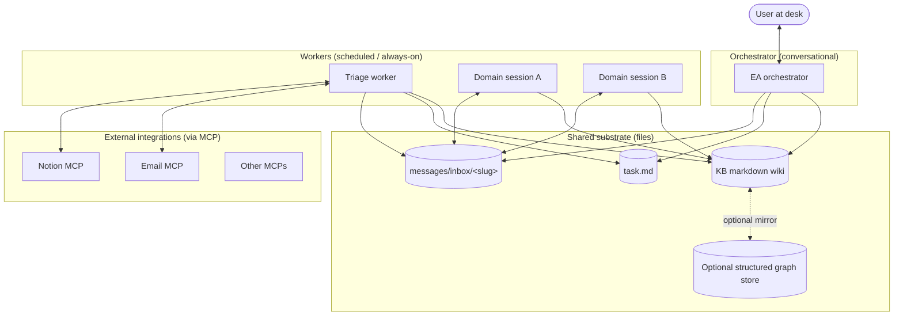

# Claude EA Pattern — A Multi-Session Executive Assistant System

A starter pattern for building a personal executive assistant out of multiple coordinated [Claude Code](https://claude.com/claude-code) sessions, communicating via the file system and a shared markdown knowledge base.

> **Status:** opinionated, hand-tuned, single-user-oriented. Not a SaaS product. The pattern is designed to be forked, edited, and made your own.

## What this is

Multiple specialized AI sessions, each owning a narrow domain, coordinated through the file system and a shared knowledge base:

- **One orchestrator session** — the conversational one you type into
- **Several worker sessions** — narrow, scheduled (e.g., email triage runs on cron) or always-on
- **File-based inter-session messaging** — drop a markdown file in another session's inbox; receiving session surfaces it automatically via hooks
- **Shared knowledge base** — markdown wiki (people, companies, themes, decisions), optionally mirrored to a structured graph store
- **Conservative defaults** — workers surface uncertainty up to the user instead of acting autonomously

## Why this pattern

- **Context isolation.** Each session has its own context window, kept lean by a narrow CLAUDE.md per session. Triage burns tokens reading email — orchestrator stays conversational.
- **File system as integration layer.** No daemons, no message bus, no DB. Markdown files in folders. Trivially debuggable.
- **Hooks for proactive surfacing.** Sessions auto-detect new inbox messages via SessionStart + PreToolUse hooks. The agent doesn't need to remember to look.
- **Schedules via `/loop`, not launchd.** Scheduled work stays conversational; you can interrupt or redirect.
- **Markdown everywhere.** Diff-able, grep-able, version-controllable. Cheapest possible interchange format.

## What's in this repo

```
.
├── README.md                    # this file
├── docs/
│   ├── architecture.md          # the pattern, end to end
│   ├── components.md            # what each piece does
│   ├── extension.md             # how to add a new session
│   ├── kb-schema.md             # knowledge base conventions
│   ├── messages-protocol.md     # inter-session messaging spec
│   └── does-framework.md        # one example classification rubric
├── prompts/
│   └── email-triage.md          # the triage worker's full prompt (template)
├── scripts/
│   ├── send-message.sh          # drop a message into another session's inbox
│   ├── check-inbox.sh           # called by hooks — surfaces unread messages
│   ├── wire-inbox.sh            # idempotently sets up inbox infra for a new session
│   ├── audit-inboxes.sh         # walks agent registry, reports gaps
│   ├── spawn-session.sh         # registers + launches a new session, auto-wires inbox
│   ├── list-agents.sh           # list registered agents
│   ├── lib-slugify.sh           # shared helpers for slug derivation
│   ├── kb-index.sh              # regenerate the KB catalog
│   ├── kb-log.sh                # append a change entry to the KB feed
│   ├── kb-lint.sh               # audit KB for orphans, stale entries, schema violations
│   ├── snapshot.sh              # auto-commit data folder daily
│   └── templates/
│       └── inbox-claude-section.md  # boilerplate injected into new agent CLAUDE.mds
├── .claude/
│   ├── CLAUDE.md                # orchestrator system prompt (template)
│   ├── settings.json            # hooks wiring
│   └── commands/                # slash commands
├── triage/                      # worker session: scheduled email triage
│   └── .claude/
│       ├── CLAUDE.md            # triage worker system prompt (template)
│       └── settings.json
└── .github/workflows/
    └── validate-kb.yml          # CI: lint the KB on push
```

## Architecture at a glance



Full architecture explainer: [`docs/architecture.md`](docs/architecture.md).

## Prerequisites

- **macOS** (some scripts use `open` and macOS path conventions; Linux works with minor edits)
- **[Claude Code](https://claude.com/claude-code)** installed and authenticated
- An agent registry to manage multiple sessions. This repo expects a TOML at `~/.config/a-team/agents.toml` (any compatible tool works).
- **bash 4+**, `python3`, `jq`, `awk`, `sed` (standard on most macs / dev machines)
- **MCP servers** as needed for your integrations — email (e.g., Superhuman), Notion, etc.

## Quick start

```bash
# 1. Clone
git clone <this-repo-url> ~/code/ea
cd ~/code/ea

# 2. Pick a data folder (where task.md, KB, messages live — keep this OUT of git)
export EA_DATA_DIR="$HOME/Documents/ea-data"
mkdir -p "$EA_DATA_DIR"/{kb/{people,companies,themes,decisions},messages/{inbox,archive},inbox-digests,drafts}

# 3. Symlink the orchestrator's config into the data folder
ln -s "$PWD/.claude" "$EA_DATA_DIR/.claude"
ln -s "$PWD/scripts" "$EA_DATA_DIR/scripts"
ln -s "$PWD/prompts" "$EA_DATA_DIR/prompts"

# 4. Customize the orchestrator's CLAUDE.md
# Open .claude/CLAUDE.md — replace placeholders (your role, priorities, projects, key people)

# 5. Register the orchestrator with your agent registry
a-team new "My EA" "$EA_DATA_DIR"

# 6. Launch
cd "$EA_DATA_DIR" && claude
```

For adding workers (triage, domain-specific loops), see [`docs/extension.md`](docs/extension.md).

## Configuration

A handful of paths are configurable. The defaults assume:

- Repo (code) at `$HOME/code/ea/` (or wherever you cloned)
- Data folder at `$HOME/Documents/ea-data/` (or wherever you set `EA_DATA_DIR`)
- Agent registry at `~/.config/a-team/agents.toml`

Search-and-replace these in the scripts if you want to change them. They're the only hardcoded assumptions in the cleaned-up scripts.

## How to think about this

**Read in order:**
1. [`docs/architecture.md`](docs/architecture.md) — the pattern explained end to end
2. [`docs/components.md`](docs/components.md) — what each component does
3. [`docs/messages-protocol.md`](docs/messages-protocol.md) — the inter-session messaging spec
4. [`docs/kb-schema.md`](docs/kb-schema.md) — knowledge base conventions
5. [`docs/extension.md`](docs/extension.md) — how to add your own worker session

**Don't try to use this as-is.** The templates in `.claude/CLAUDE.md` and `triage/.claude/CLAUDE.md` are starting points — edit them to match your role, your projects, your priorities. The pattern is what's valuable; the specific prose is meant to be replaced.

## What this is NOT

- **Not a SaaS product.** Local-first, file-based, runs on one machine.
- **Not a generic agent framework.** Every session is hand-tuned via its CLAUDE.md.
- **Not autonomous.** Workers stay on rails defined in their CLAUDE.md. They surface uncertainty to the orchestrator + user.
- **Not magic.** Bash + markdown + Claude Code primitives (hooks, MCP, skills, `/loop`).

## License

MIT. Fork it, edit it, make it yours.

## Credits

Pattern inspired by:
- Andrej Karpathy's [LLM-wiki](https://karpathy.bearblog.dev/llm-wiki/) for the three-layer knowledge base
- The 4 Disciplines of Execution framework for priority discipline
- A lot of trial and error
