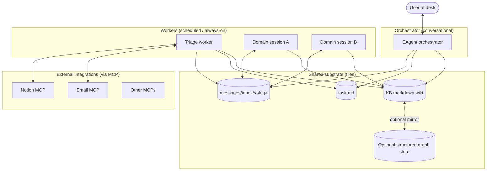

```
 ___  ___,                      
/ (_)/   |                      
\__ |    |   __,  _   _  _  _|_ 
/   |    |  /  | |/  / |/ |  |  
\___/\__/\_/\_/|/|__/  |  |_/|_/
              /|                
              \|                
```

# EAgent

[](VERSION)
[](LICENSE)
[](https://www.apple.com/macos/)
[](https://www.gnu.org/software/bash/)
[](https://www.graphiteatlas.com)
[](#related-tools)

**A multi-session executive assistant pattern for [Claude Code](https://claude.com/claude-code).**

A starter for building a personal executive assistant out of multiple coordinated Claude Code sessions, communicating via the file system and a shared markdown knowledge base.

## What this is

Multiple specialized AI sessions, each owning a narrow domain, coordinated through the file system and a shared knowledge base:

- **One orchestrator session** — the conversational one you type into
- **Several worker sessions** — narrow, scheduled (e.g., email triage runs on cron) or always-on
- **File-based inter-session messaging** — drop a markdown file in another session's inbox; receiving session surfaces it automatically via hooks
- **Shared knowledge base** — markdown wiki (people, companies, themes, decisions), optionally mirrored to a parallel structured graph store like [Graphite Atlas](https://www.graphiteatlas.com)
- **Conservative defaults** — workers surface uncertainty up to the user instead of acting autonomously

## Why this pattern

- **Context isolation.** Each session has its own context window, kept lean by a narrow CLAUDE.md per session. Triage burns tokens reading email — orchestrator stays conversational.
- **File system as integration layer.** No daemons, no message bus, no DB. Markdown files in folders. Trivially debuggable.
- **Hooks for proactive surfacing.** Sessions auto-detect new inbox messages via SessionStart + PreToolUse hooks. The agent doesn't need to remember to look.
- **Schedules via `/loop`, not launchd.** Scheduled work stays conversational; you can interrupt or redirect.
- **Markdown everywhere.** Diff-able, grep-able, version-controllable. Cheapest possible interchange format.

## What's in this repo

```
.
├── README.md                    # this file
├── docs/
│   ├── architecture.md          # the pattern, end to end
│   ├── components.md            # what each piece does
│   ├── extension.md             # how to add a new session
│   ├── kb-schema.md             # knowledge base conventions
│   ├── messages-protocol.md     # inter-session messaging spec
│   └── does-framework.md        # one example classification rubric
├── prompts/
│   └── email-triage.md          # the triage worker's full prompt (template)
├── scripts/
│   ├── send-message.sh          # drop a message into another session's inbox
│   ├── check-inbox.sh           # called by hooks — surfaces unread messages
│   ├── wire-inbox.sh            # idempotently sets up inbox infra for a new session
│   ├── audit-inboxes.sh         # walks agent registry, reports gaps
│   ├── spawn-session.sh         # registers + launches a new session, auto-wires inbox
│   ├── list-agents.sh           # list registered agents
│   ├── lib-slugify.sh           # shared helpers for slug derivation
│   ├── kb-index.sh              # regenerate the KB catalog
│   ├── kb-log.sh                # append a change entry to the KB feed
│   ├── kb-lint.sh               # audit KB for orphans, stale entries, schema violations
│   ├── snapshot.sh              # auto-commit data folder daily
│   ├── inbox-notifier.sh        # fswatch daemon: macOS banner when a message lands
│   ├── install-inbox-notifier.sh  # one-shot installer for the notifier (launchd)
│   └── templates/
│       └── inbox-claude-section.md  # boilerplate injected into new agent CLAUDE.mds
├── .claude/
│   ├── CLAUDE.md                # orchestrator system prompt (template)
│   ├── settings.json            # hooks wiring
│   └── commands/                # slash commands
├── triage/                      # worker session: scheduled email triage
│   └── .claude/
│       ├── CLAUDE.md            # triage worker system prompt (template)
│       └── settings.json
├── user-commands/               # user-level slash commands (install to ~/.claude/commands/)
│   ├── checkmsg.md              # /checkmsg — manual peek of current session's inbox
│   ├── sendmsg.md               # /sendmsg <slug> <body> — drop a message in another session
│   └── start-triage-loops.md    # /start-triage-loops — arm 3 cron jobs for triage worker
└── .github/workflows/
    └── validate-kb.yml          # CI: lint the KB on push
```

## Architecture at a glance



Full architecture explainer: [`docs/architecture.md`](docs/architecture.md).

## Prerequisites

> [!NOTE]
> EAgent assumes macOS. Some scripts use `open` and macOS path conventions; Linux works with minor edits.

- **[Claude Code](https://claude.com/claude-code)** installed and authenticated
- An agent registry to manage multiple sessions. EAgent expects a TOML at `~/.config/a-team/agents.toml` — the reference implementation is [a-team](https://github.com/nigelglenday/a-team), but any compatible tool works.
- **bash 4+**, `python3`, `jq`, `awk`, `sed` (standard on most macs / dev machines)
- **MCP servers** as needed for your integrations — email (e.g., Superhuman), Notion, [Graphite Atlas](https://www.graphiteatlas.com) for a parallel graph store, etc.

## Quick start

> [!TIP]
> Keep the repo (code) and the data folder (task.md, KB, messages) separate. The repo is shareable; the data is personal. Symlinks bridge them at runtime.

```bash
# 1. Clone
git clone <this-repo-url> ~/code/eagent
cd ~/code/eagent

# 2. Pick a data folder (where task.md, KB, messages live — keep this OUT of git)
export EA_DATA_DIR="$HOME/Documents/ea-data"
mkdir -p "$EA_DATA_DIR"/{kb/{people,companies,themes,decisions},messages/{inbox,archive},inbox-digests,drafts}

# 3. Symlink the orchestrator's config into the data folder
ln -s "$PWD/.claude" "$EA_DATA_DIR/.claude"
ln -s "$PWD/scripts" "$EA_DATA_DIR/scripts"
ln -s "$PWD/prompts" "$EA_DATA_DIR/prompts"

# 4. Install user-level slash commands (works in every Claude Code session)
mkdir -p ~/.claude/commands
cp user-commands/*.md ~/.claude/commands/

# 5. Customize the orchestrator's CLAUDE.md
# Open .claude/CLAUDE.md — replace placeholders (your role, priorities, projects, key people)

# 6. Register the orchestrator with your agent registry
a-team new "My EA" "$EA_DATA_DIR"

# 7. Launch
cd "$EA_DATA_DIR" && claude
```

For adding workers (triage, domain-specific loops), see [`docs/extension.md`](docs/extension.md).

## Optional: macOS banner when a message lands

The SessionStart + PreToolUse hooks only fire on session activity. If a session is **open and idle** when a new message arrives, nothing surfaces until you act on the session.

To close that gap, install the **fswatch notifier** — a tiny background daemon that watches `messages/inbox/` for new files and fires a macOS notification the moment one appears:

```bash
brew install fswatch terminal-notifier
bash scripts/install-inbox-notifier.sh
```

> [!NOTE]
> `terminal-notifier` is strongly recommended. macOS often silently suppresses `osascript`-based notifications when fired from launchd context, since they inherit Script Editor's permission state. `terminal-notifier` has its own bundle ID and gets a clean permission prompt on first use. The installer will warn if it's not installed.

What it does:
- Copies the watcher to `~/Library/Application Support/eagent/` (macOS TCC requires this — launchd can't read scripts under `~/Documents/` without Full Disk Access)
- Generates a `launchd` plist at `~/Library/LaunchAgents/com.eagent.inbox-notifier.plist`
- Loads it (starts at login, restarts on death)
- Logs go to `~/Library/Logs/eagent-inbox-notifier{.log,.err.log}`

You'll see a banner like "📨 worker-a has new message: <title>" whenever any session drops a message in any inbox. Clicking into the session triggers the normal hook flow that surfaces it.

To uninstall, see the messages printed at the end of the installer.

## Configuration

> [!NOTE]
> A handful of paths are configurable. Search-and-replace these in the scripts if you want to change them — they're the only hardcoded assumptions in the cleaned-up scripts.

Defaults:

- Repo (code) at `$HOME/code/eagent/` (or wherever you cloned)
- Data folder at `$HOME/Documents/ea-data/` (or wherever you set `EA_DATA_DIR`)
- Agent registry at `~/.config/a-team/agents.toml`

## Optional: parallel structured graph store

EAgent's KB is markdown-first — that handles ~70% of practical queries via grep + wikilinks. For typed, multi-hop structural queries ("who approves wires over $100K?", "if I change System X, what processes are affected?"), mirror your KB into a parallel structured graph store.

The reference implementation is [**Graphite Atlas**](https://www.graphiteatlas.com) — a knowledge graph platform with a typed ontology (Person, Position, Process, System, Outcome, etc.) and MCP server. KB markdown files cross-reference graph nodes via a `graph_uuid` field in frontmatter; graph nodes have a `kb_file` property pointing back.

See [`docs/kb-schema.md`](docs/kb-schema.md) for the cross-reference convention. Any graph DB or knowledge graph product works — Atlas is just the cleanest fit for this pattern.

## How to think about this

**Read in order:**
1. [`docs/architecture.md`](docs/architecture.md) — the pattern explained end to end
2. [`docs/components.md`](docs/components.md) — what each component does
3. [`docs/messages-protocol.md`](docs/messages-protocol.md) — the inter-session messaging spec
4. [`docs/kb-schema.md`](docs/kb-schema.md) — knowledge base conventions
5. [`docs/extension.md`](docs/extension.md) — how to add your own worker session

> [!WARNING]
> Don't try to use EAgent as-is. The templates in `.claude/CLAUDE.md` and `triage/.claude/CLAUDE.md` are starting points — edit them to match your role, your projects, your priorities. The pattern is what's valuable; the specific prose is meant to be replaced.

## License

MIT — see [LICENSE](LICENSE).
